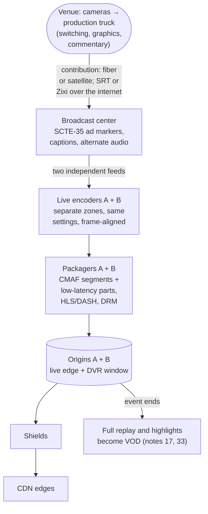
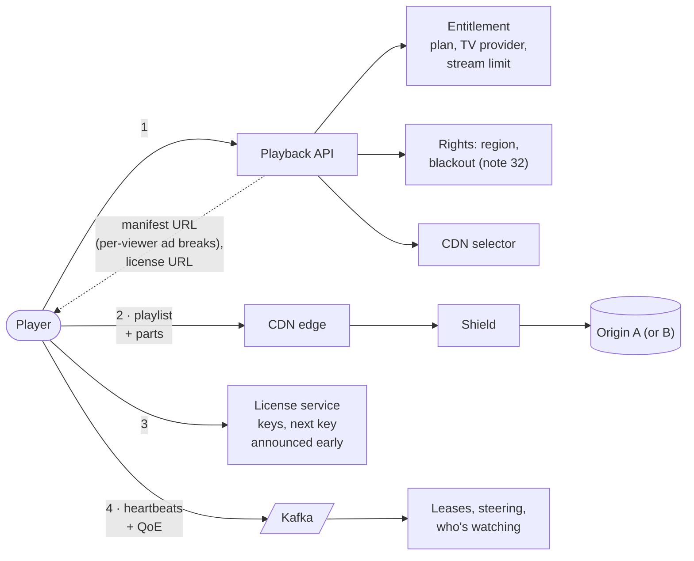

# Live Sports Streaming

**The prompt:** "Design live streaming for ESPN — hundreds of games a week, a few enormous ones, as close to real time as TV, and the stream must never stop." Since August 2025 the ESPN app has been a full streaming service carrying all of ESPN's networks, with multiview, integrated stats, fantasy and betting information — so this is live video *plus* live data that has to stay in sync with it. What it tests: the live pipeline (contribution → encode → package → origin → CDN), **where latency comes from and what removing it costs**, redundancy when a moment can't be re-encoded later, per-viewer ads inside a live stream, and regional rights. Related: [17 · on-demand streaming](17_Disney_Plus_Video_Streaming.md) (the same playback path), [18 · traffic spikes](18_Premiere_Traffic_Spike.md) (kickoff), [16 · stream limits](16_Concurrent_Stream_Limits.md), [32 · catalog & rights](32_Catalog_Rights_Availability.md) (blackouts).

## Clarify first

**Functional**

- 24/7 linear channels (ESPN, ESPN2, …) and one-off event streams (individual games), on TVs, phones, web and consoles.
- Watch live; pause, rewind and **start over** within a DVR window; jump back to live.
- Alternate audio (languages, alternate commentary) and captions (often a legal requirement for content that aired on TV).
- **Multiview:** several games on one screen.
- Ad breaks replaced per viewer where rights and plan allow (server-side ad insertion).
- **Regional rights:** some games are blacked out in some markets; some need a TV-provider sign-in.
- Live stats, scores and betting odds alongside the picture — in sync with it.
- When the event ends, a full replay and highlights become on-demand titles.

**Non-functional**

- **Latency:** within ~5–10 s of real time for flagship events. Classic HLS runs 10–30 s behind, and fans notice when their phones buzz with the score before the goal appears.
- **No gaps:** a live moment can't be re-encoded later, so every stage is redundant.
- **Scale:** most events draw thousands to hundreds of thousands; a few draw tens of millions. Disney+ Hotstar peaked at 59M concurrent viewers for the 2023 Cricket World Cup final; Netflix's Paul–Tyson fight hit 65M concurrent streams — with widespread buffering.
- **Breadth:** hundreds of simultaneous events on a busy Saturday means hundreds of encoder pipelines, not one.
- Joining a live stream in under 2–3 s.

## Back-of-envelope

- **Egress:** 20M viewers × ~5 Mbps = **100 Tbps**, reserved across several CDNs, as in [note 18](18_Premiere_Traffic_Spike.md).
- **Requests — the hidden cost of low latency:** with 6 s segments a viewer makes ~0.5 requests/s (video, audio, playlist) → 10M req/s for 20M viewers. With ~1 s low-latency parts it's ~3 requests/s each → **~60M req/s**. Low latency multiplies CDN request load about 6×.
- **Encoders:** 300 simultaneous events × 2 redundant pipelines = **600 live encoders**, each producing a full ladder in real time. Reserve capacity for weekend peaks; small events get fewer rungs.
- **DVR storage:** a 4-hour game × a ladder summing ~20 Mbps ≈ 36 GB; 300 events ≈ 11 TB. Small — and the recording is kept for the replay anyway.

## API

```text
GET  /v1/live/events?date=…&sport=…    schedule, status, rights hints
POST /v1/playback/sessions             { eventId | channelId, profileId,
                                         device, location }
  200 { sessionId, manifestUrl (per viewer, with ad breaks), licenseUrl,
        cdns, liveEdge: { targetLatencyMs, dvrWindowSec } }
  403 { reason: BLACKED_OUT | TV_PROVIDER_REQUIRED | NOT_ENTITLED }
  409 { reason: STREAM_LIMIT_REACHED, activeStreams }          (note 16)

GET {cdn}/live/{eventId}/v/1080p/playlist.m3u8?_HLS_msn=1024&_HLS_part=2
    blocking reload: the answer comes once part 2 of segment 1024 exists
GET {cdn}/live/{eventId}/v/1080p/seg_1024.part2.m4s

WS  /v1/live/{eventId}/data            scores, stats, odds — each timestamped
```

## Data model

| Entity | Key fields | Notes |
|---|---|---|
| LiveEvent | eventId, sport, teams, scheduledStart, state, channelId, rightsRef | State comes from the feed, not the schedule |
| Pipeline | eventId, side (A or B), encoder, packager, origin, health | Two per event, fully independent |
| LiveEdge | eventId, mediaSequence, part, programDateTime | The newest position — hot, in memory |
| AdBreak | eventId, scte35Id, start, duration | Signalled in the broadcast feed |
| BlackoutRule | eventId, regions (TV markets, postal codes), platforms | Compiled into availability ([note 32](32_Catalog_Rights_Availability.md)) |
| DataEvent | eventId, seq, occurredAt, type, payload | Scores and stats, for synced overlays |

## Architecture

**From the venue to the CDN**



**From the CDN to the viewer**



The playback path is the one from [note 17](17_Disney_Plus_Video_Streaming.md) — entitlements, stream limits, CDN choice, DRM. What's new is the live edge, the redundancy, the ad breaks and the rights.

## Deep dives

### 1. Where the latency comes from

| Stage | Classic HLS | Low-latency HLS/DASH |
|---|---|---|
| Production + contribution | 1–3 s | 1–3 s |
| Encoding | 1–2 s | ~1 s (short lookahead) |
| Packaging | a whole 6 s segment | one ~0.3–1 s part |
| Player buffer | ~3 segments ≈ 18 s | a few parts + margin ≈ 2–3 s |
| **Behind live** | **~20–30 s** | **~3–7 s** |

- A player can't fetch a segment until it's finished, and it keeps a few in its buffer — that's where most of the delay lives. **Low-latency HLS** publishes each segment as small **parts**, adds **preload hints** (ask for the next part before it exists) and **blocking playlist reloads** (the server holds the request until the next part is ready — see the LLD). LL-DASH does the same with chunked CMAF over chunked transfer encoding.
- **What it costs:** a smaller buffer means more stalls on shaky networks, and several times more requests. Offer low latency for flagship events and good networks, and let struggling players drift back to a safer latency.
- **Hold everyone at a target latency:** players speed up slightly (~1.05×) when they've fallen behind and slow down when they're too close to the edge — so friends watching on different devices see the goal at the same moment.

### 2. The spoiler problem — keep data in sync with the picture

- Scores, stats and betting odds come from a data feed that runs seconds ahead of the video. The stats bar mustn't say "GOAL" before the ball goes in.
- Stamp the video with wall-clock time (`EXT-X-PROGRAM-DATE-TIME` in HLS) and every data event with when it happened; the player shows only data older than the frame it's displaying (LLD below).
- Push alerts: heartbeats tell you who is watching this game right now — delay or suppress the alert for them.

### 3. Redundancy — you can't re-encode a live moment

- **Two independent pipelines**, A and B, in different zones (or regions), from the contribution feed to the origin. The encoders are locked to the same clock, so A and B produce segments with the same numbers and timestamps: interchangeable, and a player or CDN can switch mid-stream without a glitch.
- **Input failover:** if the primary contribution feed drops, the encoder switches to the backup within frames. If every input dies, it shows a slate ("we'll be right back") rather than leaving players stalled.
- Shields and players know both origins: a 404 or timeout from A retries B.
- Rehearse it: kill pipeline A during a low-stakes game and check that nobody notices.

### 4. The live edge is one very hot object

- On demand, viewers are spread across a title's timeline. Live, **everyone wants the same newest part**, so the CDN must collapse concurrent misses into one origin request (request coalescing at the edge and the shield).
- **Don't cache 404s** for parts that don't exist yet (negative caching): a player asking a moment too early would then stall on a cached error.
- Playlists get very short TTLs (about one part); segments never change once written, so they cache for a long time.
- With blocking reloads, the CDN holds millions of open requests for a second at a time — choose CDNs that handle it well.

### 5. Per-viewer ads in a live stream

- The broadcast marks each break with a **SCTE-35** cue. The packager carries it into the manifest, and the ad-insertion service stitches per-viewer ads — pre-transcoded to the same ladder — into each viewer's manifest for exactly the break's length, padding with a slate if the ads run short.
- **The ad-break stampede:** millions of viewers reach the same break in the same second. Fetch decisions before the break, cache them per audience segment, and fall back to a house ad or slate if decisioning is slow. The stream never waits for an ad (tracker #37).

### 6. Rights, blackouts and TV-provider sign-in

- Rights are regional: a game can be blacked out in its local TV market or carried only by a partner there. Blackout rules compile into the same availability snapshots as on-demand rights ([note 32](32_Catalog_Rights_Availability.md)), checked at playback start from the viewer's location (IP, plus the account's home region).
- Some streams need a **TV-provider sign-in** ("TV Everywhere") — one more entitlement source alongside direct subscriptions ([note 30](30_Subscriptions_Billing.md)).
- Unlike stream limits, **don't fail open on rights** — they're contractual. Keep the rules in a local snapshot so the check can't be "down", and apply the conservative rule when the location can't be determined.

### 7. DVR, start-over and the replay

- The origin keeps a sliding window of segments (or the whole event). "Start over" is a playlist beginning at the event's first segment — the same segments, no extra encoding.
- Key moments from the data feed become timeline markers ("jump to the touchdown").
- When the event ends, the recording becomes on-demand content: re-packaged, highlights clipped, catalog entry published ([note 33](33_Media_Ingest_Transcoding.md)).

### 8. Multiview

- **On the device:** decode 2–4 streams and lay them out. Flexible and costs you nothing extra to produce, but it's heavy on the device, uses N× the bandwidth, and only capable devices can do it.
- **In the cloud:** compose the games into one mosaic stream. One decode on the device, but a fixed layout and an extra encoder per combination — viable only for a few curated combinations.
- Policy questions to raise: does a four-game multiview count as one stream or four ([note 16](16_Concurrent_Stream_Limits.md))? Whose audio plays?

### 9. Long-running channels: key rotation

- A 24/7 channel shouldn't use one content key forever. Rotate keys periodically, but **announce the next key ahead of time** so players fetch it early, with jitter — otherwise every viewer requests a license in the same second the key changes: a self-inflicted license stampede.

## LLD

Blocking playlist reload at the origin (LL-HLS `_HLS_msn` / `_HLS_part`) — hold each request until its part exists instead of making players poll:

```java
public class LiveEdge {
    private final ConcurrentSkipListMap<PartId, Part> parts = new ConcurrentSkipListMap<>();
    private final ConcurrentHashMap<PartId, CompletableFuture<Part>> waiters = new ConcurrentHashMap<>();
    private volatile PartId newest = PartId.NONE;

    /** The packager calls this as each part (~0.3–1 s of media) is written. */
    public void publish(Part p) {
        parts.put(p.id(), p);
        newest = p.id();
        CompletableFuture<Part> w = waiters.remove(p.id());
        if (w != null) w.complete(p);
        evictOlderThanDvrWindow();
    }

    public CompletableFuture<Part> await(PartId id, Duration timeout) {
        if (id.isAfter(newest.next()))                      // only the next part may be waited for
            return CompletableFuture.failedFuture(new TooFarAheadException(id));
        Part ready = parts.get(id);
        if (ready != null) return CompletableFuture.completedFuture(ready);
        CompletableFuture<Part> shared = waiters.computeIfAbsent(id, k -> new CompletableFuture<>());
        Part raced = parts.get(id);                         // published between the two lookups?
        if (raced != null) shared.complete(raced);
        return shared.copy().orTimeout(timeout.toMillis(), MILLISECONDS);   // time out this caller only
    }
}
```

- `copy()` matters: calling `orTimeout` on the shared future would fail every waiter the moment the first caller's timer fired.
- Refusing ids more than one part ahead stops clients parking requests for parts that won't exist for minutes.

Showing only the data the picture has reached:

```java
List<DataEvent> visible(List<DataEvent> events, Instant segmentProgramDateTime, Duration intoSegment) {
    Instant onScreen = segmentProgramDateTime.plus(intoSegment);    // wall-clock time of the frame on screen
    return events.stream().filter(e -> !e.occurredAt().isAfter(onScreen)).toList();
}
```

Blackout check — rules compiled per event, evaluated from the viewer's location:

```java
public boolean blackedOut(LiveEvent event, ViewerLocation where, Platform platform) {
    return event.blackoutRules().stream().anyMatch(rule ->
            rule.platforms().contains(platform) && rule.regions().contains(where.tvMarket()));
}
```

An event's life, driven by the feed rather than the clock: `SCHEDULED → PRE_SHOW → LIVE ⇄ AD_BREAK → POST_SHOW → ENDED → REPLAY_AVAILABLE`. Anything keyed to the **scheduled** end — encoder shutdown, DVR retention, rights windows, ad schedules — breaks when the game goes to overtime. Drive it from state changes, with generous padding.

## Failure modes

| Failure | What viewers see | What the design does |
|---|---|---|
| Contribution feed drops | Frozen picture | The encoder switches to the backup feed within frames; slate if both fail |
| Encoder A dies | Nothing | Pipeline B carries on; its segments are interchangeable with A's |
| Origin A down | 404s, timeouts | Shields and players retry origin B |
| A CDN struggles at kickoff | Rebuffering in a region | Steering and mid-stream failover ([note 17](17_Disney_Plus_Video_Streaming.md)) |
| Ad decisioning slow | The break could stall | Decisions fetched ahead; house ad or slate on timeout — never block the stream |
| Key rotation | A license stampede | Next key announced early; players fetch with jitter |
| Latency drifts to 40 s | Spoilers, angry fans | Players catch up (playback rate) or jump to live; alert on a latency SLO |
| The game goes to overtime | Scheduled shutdowns cut the stream | Everything follows event state, not the schedule |

## Trade-offs to say out loud

- **Latency vs stability and cost:** smaller buffers stall more, and parts multiply requests. Low latency for flagship events and good networks, not for everyone by default.
- **Device vs cloud multiview:** flexibility and zero production cost vs one decode on weak devices.
- **Full A/B redundancy:** twice the encoder bill — the price of never re-encoding a moment.
- **Server-side vs client-side ad insertion:** SSAI can't be ad-blocked and plays seamlessly, but needs per-viewer manifests; client-side is simpler but stalls and can be blocked.
- **DVR window length vs storage** — cheap either way next to egress.

## Trick questions

- **"Why is the stream 30 seconds behind TV?"** — A player can't fetch a segment until it's complete and buffers about three: 6 s × 3 = 18 s, plus 5–10 s of production, encoding and packaging. Parts and blocking reloads cut it to a few seconds.
- **"Why not WebRTC for sub-second latency?"** — It doesn't ride standard CDN caching, so reaching millions is expensive, and ABR, DRM and ad insertion are built around HTTP segments. 3–7 s is enough for sports; sub-second delivery exists for betting and auctions, at a price.
- **"Phones buzz with the score before the goal appears."** — Sync data to the picture with program-date-time, and suppress alerts for people whose heartbeats show they're watching.
- **"The encoder crashes during a penalty kick."** — Pipeline B is already producing identical, interchangeable segments; players switch without noticing.
- **"Kickoff vs a VOD premiere — what's different?"** — Everyone requests the same newest object; the future can't be pre-positioned; request coalescing is essential; low latency multiplies requests; the whole join lands in the same seconds.
- **"The CDN cached a 404 for the next part."** — Negative caching. Turn it off for live paths, or keep it far below a part's duration.
- **"The game goes to overtime."** — Anything scheduled by clock time breaks; drive from event state.
- **"Would you fail open on blackouts, like stream limits?"** — No: rights are contractual. Serve them from a local snapshot so the check can't be down, and be conservative when location is unknown.
- **"A viewer on hotel Wi-Fi keeps stalling in low-latency mode."** — The player falls back to a bigger buffer and a higher latency; low latency is a target, not a promise.
- **"Does multiview count as four streams?"** — Policy — but it's N× the bandwidth, and the answer should be decided before launch.

## Similar systems

| System | What changes |
|---|---|
| Netflix live events | Paul–Tyson (Nov 2024): 65M concurrent streams and widespread buffering — live is a different system from on-demand, not a feature of it |
| Disney+ Hotstar cricket | 59M concurrent viewers in 2023, with ladder pre-scaling ([note 18](18_Premiere_Traffic_Spike.md)) |
| Twitch, YouTube Live | Millions of creators ingest their own streams; full ladders only for popular channels; chat is part of the product |
| Zoom and WebRTC | Sub-second and two-way, with media servers instead of CDNs |
| Live betting feeds | Data, not video, at sub-second latency — which is why overlays need the sync above |
| Live radio | The same HLS pipeline at tiny bitrates |

## Commonly asked

- Walk the pipeline from the camera to the viewer. Where does the latency come from?
- How do you get from 30 s behind live to 5 s, and what does it cost?
- How do you survive an encoder failure mid-game?
- How do per-viewer ads work in a live stream?
- How would you implement blackouts?
- What's different about kickoff compared with a VOD premiere?
- How do you stop score alerts and stats spoiling the stream?

## Sources

- [ESPN's direct-to-consumer service launch (The Walt Disney Company)](https://thewaltdisneycompany.com/news/espns-direct-to-consumer-launch-date/)
- [Low-latency HLS: 2–5 s vs 10–30 s for classic HLS (Ant Media)](https://antmedia.io/low-latency-hls-or-ll-hls/) · [HLS latency and how to fix it (Wowza)](https://www.wowza.com/blog/hls-latency-sucks-but-heres-how-to-fix-it)
- [Tech issues hit Netflix amid 65M concurrent Paul–Tyson streams (SportBusiness)](https://www.sportbusiness.com/news/tech-issues-hit-netflix-amid-65m-concurrent-paul-tyson-streams/) · [Can streaming handle major live events? (NPR)](https://www.npr.org/2024/11/21/nx-s1-5198106/is-video-streaming-infrastructure-up-to-par)
- [59M peak concurrent viewers for the 2023 World Cup final (Business Standard)](https://www.business-standard.com/cricket/world-cup/world-cup-ind-aus-match-records-peak-viewership-of-59-mn-on-disney-hotstar-123111900827_1.html)
