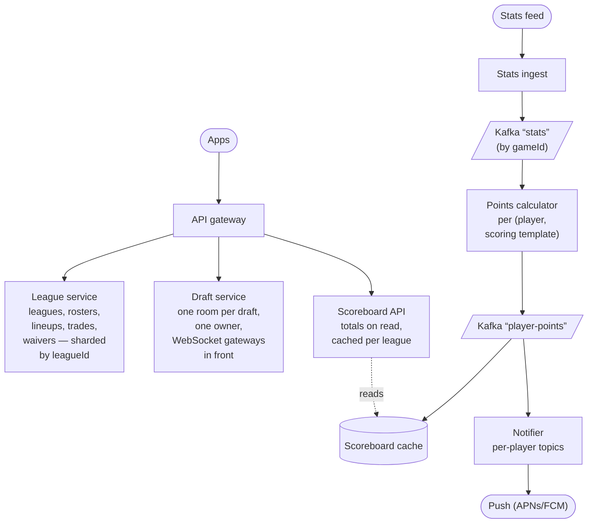

# Fantasy Sports: Draft Room & Live Scoring

**The prompt:** "Design ESPN Fantasy Football — leagues, a live draft, weekly lineups, waivers and trades, and live scoring on Sundays." ESPN Fantasy Football had a record 14M+ players in 2025, and Sunday of Week 1 was the busiest day in the Fantasy app's history. It tests real-time rooms with a **server-authoritative clock**, making "two managers drafted the same player" impossible, fanning one stat change out to millions of teams *without* millions of computations, time-based locks, deterministic batch jobs (waivers), and recomputing history when stats are corrected. Related: [18 · traffic spikes](18_Premiere_Traffic_Spike.md) (draft weekend, Sunday 1 PM), [19 · live sports streaming](19_Live_Sports_Streaming.md) (the same stats feed).

## Clarify first

**Functional**

- Leagues of ~8–14 teams with settings: scoring rules (standard, PPR, custom), roster slots, draft type, waiver type, trade review.
- **Draft:** snake (the order reverses every round) or auction; a live room with a pick clock (say 60–90 s); autopick when the clock runs out or a manager is absent; queues and rankings; chat; mock drafts.
- **Season:** weekly lineups where each player **locks at his own game's kickoff**; waivers processed in a batch at set times (by priority order or FAAB bids); free agents; trades with a review period and a deadline.
- **Live scoring:** fantasy points in real time from official stats; matchup screens; alerts ("your WR just scored").
- Standings and playoffs. **Stat corrections** arrive days later and can change results.

**Non-functional**

- Scale: 14M+ players; assume ~2M leagues × ~10 teams ≈ 20M teams.
- **Draft weekend:** assume ~100K drafts live in the peak hour × ~10 managers ≈ **1M WebSocket connections**.
- **Sunday 1 PM ET:** millions of managers watching scores at the same time.
- A pick reaches everyone in the room in under a second; points update within seconds of the stats feed.
- Correctness: no player drafted twice, no pick out of turn, no lineup change after a lock, waivers fair and repeatable, trades atomic.

## Back-of-envelope

- **Stat events are few:** ~150 plays per NFL game × 13–16 games on a Sunday ≈ 2,000 plays, each touching 2–5 players → ~10K stat changes in an afternoon.
- **The fan-out is huge:** a star QB is rostered in nearly every league → ~2M teams affected by one touchdown. Recomputing 2M teams per play is the trap.
- **But points don't depend on the team** — they depend on (the player's stat line, the scoring rules). Compute per player per **scoring template** (a few standard templates plus deduplicated custom ones); a team's total is just the sum of its starters.
- **Scoreboard reads:** 10M managers refreshing every ~30 s ≈ **330K reads/s**, served from a cache per league.
- **Draft picks:** 100K rooms × ~1 pick/min ≈ 1.7K picks/s, each broadcast to ~10 people — small. The hard part is 1M sockets and 100K pick clocks running at once, not throughput.

## API

```text
POST /v1/leagues                      { name, settings } → leagueId
POST /v1/drafts/{id}/picks            { pickNo, playerId }, idempotent by pickNo
WS   /v1/drafts/{id}                  PICK_MADE, ON_THE_CLOCK(deadline),
                                      CHAT, DRAFT_COMPLETE — each with a seq
PUT  /v1/teams/{id}/lineups/{week}    { slots, version }; 409 if stale/locked
POST /v1/leagues/{id}/waiver-claims   { add, drop, bid? }
POST /v1/leagues/{id}/trades          { give, get } · POST …/trades/{id}/accept
GET  /v1/leagues/{id}/scoreboard      ?week=N, cached per league for a few s
WS   /v1/live?teams=…                 SCORE_UPDATE for the teams on screen
```

The server sends each pick's **deadline** as an absolute time, not a tick every second: clients count down locally and the server enforces.

## Data model

```text
league          (league_id, settings, scoring_template_id)         shard key
team            (team_id, league_id, owner_id, waiver_priority, faab_left)
draft           (draft_id, league_id, type, pick_order, status,
                 pick_no, deadline, owner_lease)
draft_pick      (draft_id, pick_no, team_id, player_id, auto,
                 UNIQUE (draft_id, pick_no), UNIQUE (draft_id, player_id))
roster_entry    (league_id, team_id, player_id,
                 UNIQUE (league_id, player_id))
lineup          (team_id, week, slots, version)
player_stats    (player_id, game_id, stat_line, version)           from the feed
player_points   (player_id, week, template_id, points, stats_version)
scoring_template(template_id = hash(rules), rules)                 shared
waiver_claim    (claim_id, league_id, team_id, add, drop, bid, status)
trade           (trade_id, league_id, from_team, to_team, give, get,
                 status, review_ends_at, version)
```

- **Two unique constraints do the heavy lifting:** `UNIQUE (draft_id, pick_no)` — one pick per slot — and `UNIQUE (draft_id, player_id)` — a player drafted once. Retries and races turn into constraint violations, never duplicates.
- `UNIQUE (league_id, player_id)` on rosters: a player belongs to at most one team per league.
- Everything league-scoped lives on the league's shard, so trades and waivers are single-shard transactions. Players, games and stats are global reference data, cached everywhere.

## Architecture



## Deep dives

### 1. The draft room

- **One owner per room:** each draft is owned by one draft-service instance (consistent hashing on draftId, or a lease in a coordination store). WebSocket gateways forward messages to the owner through pub/sub keyed by draftId. Everything in a room runs on its own single thread — an actor — so there are no locks inside a room.
- **The clock lives on the server:** the owner stores the pick's `deadline`, broadcasts it, and sets a timer. Clients draw the countdown from the deadline, correcting for their clock's offset from the server timestamps in each message.
- **Making a pick:** check it's this team's turn and the player is available → insert into `draft_pick` → advance the pick number and deadline → broadcast `PICK_MADE` with a sequence number. The database constraints stay the final guard, even if two instances briefly both believe they own the room.
- **The timer fires → autopick:** if the pick is still open, take the best available player from the team's queue or rankings through the **same** path. A manual pick racing the autopick targets the same pick number, so exactly one wins and the other gets "stale".
- **Reconnects:** the client sends the last sequence number it saw; the owner replays what it missed from the pick log — no gaps, no duplicates.
- **The owner crashes:** another instance takes over the room's lease, rebuilds the state from `draft_pick` (the source of truth), extends the current deadline by a grace period, and clients reconnect.
- **Auction drafts:** a nominated player gets a countdown that resets on every higher bid. A bid is valid only if it beats the current bid and leaves enough budget to fill the roster: `bid ≤ budgetLeft − (emptySlots − 1) × minBid`.

### 2. Live scoring without recomputing millions of teams

- The licensed stats feed → normalize → Kafka keyed by gameId (ordered per game). Each message carries the player's **whole stat line** with a version, not an increment — so a duplicate or replayed message changes nothing.
- **Points per (player, scoring template):** when a stat line changes, recompute that player's points for each template in use. Custom settings are hashed into template ids, so leagues with identical rules share one computation.
- **Team totals on read:** a scoreboard is ~10 teams × ~9 starters ≈ 90 lookups into a cache of player points — cheap enough to compute per request and cache per league for a few seconds.
- **Push only to people who are looking:** open matchup screens subscribe over WebSocket to their teams; alerts go through per-player topics (managers subscribe to their players), so the push provider does the fan-out for a star's touchdown.
- Projections and win probabilities refresh on a timer, not on every play.

### 3. Lineup locks

- A player locks when **his** game starts — Thursday, Sunday and Monday games lock at different times. Use the game's real start from the feed (weather delays happen), not just the schedule.
- Check the lock at write time with the server's clock, inside the transaction, with an optimistic version on the lineup: a request arriving a second after kickoff is refused even if the app still showed the player as movable.
- A locked player can't move out, and nobody can move into a locked player's slot.

### 4. Waivers — a deterministic batch

- Claims pile up during the week; each league's waivers run at a set time (say early Wednesday), in priority order (rolling, or reverse standings) or by FAAB bid with priority breaking ties.
- **Deterministic and rerunnable:** snapshot the priorities, sort the claims, apply them one by one with roster checks, record every result. The same inputs give the same outcome, so a crashed job simply runs again.
- Millions of independent leagues: shard the job by league and stagger it.

### 5. Trades

- Propose → accept → review period (league vote or commissioner) → execute: swap players between two rosters in **one transaction** on the league's shard, re-checking roster rules.
- A player in both a waiver claim and a trade: versions on the roster rows make whichever commits second fail validation.
- Players already locked this week move for next week.

### 6. Stat corrections

- Official corrections arrive days later. Store stats as versions; recompute the affected player points, then the matchup results, then standings — and notify anyone whose result flipped.
- Idempotent: results are keyed by (league, week, stats version), so replaying a correction is harmless. Set a cut-off (say, before the next waiver run) after which results are final.

### 7. The spikes

- **Draft weekend:** pre-scale gateways and draft services; mock drafts are the first thing to shed ([note 18](18_Premiere_Traffic_Spike.md)).
- **Sunday 1 PM:** scoreboards from the per-league cache, player pages and projections from the CDN, alerts through topics.

## LLD

Snake order:

```java
/** The team on the clock for a 0-based pick number: every other round runs backwards. */
static String teamFor(int pickNo, List<String> order) {
    int n = order.size(), round = pickNo / n, i = pickNo % n;
    return order.get(round % 2 == 0 ? i : n - 1 - i);
}
```

The draft room as an actor — every method runs on the room's own single thread:

```java
public final class DraftRoom {
    private final String draftId;
    private final List<String> order;
    private final int totalPicks;
    private final Set<String> drafted = new HashSet<>();
    private int pickNo;                                    // the pick on the clock
    private Instant deadline;

    PickResult pick(String teamId, String playerId, int expectedPickNo, boolean auto) {
        if (pickNo >= totalPicks) return PickResult.DRAFT_OVER;
        if (expectedPickNo != pickNo) return PickResult.STALE;              // someone got there first
        if (!teamId.equals(teamFor(pickNo, order))) return PickResult.NOT_YOUR_TURN;
        if (drafted.contains(playerId)) return PickResult.PLAYER_TAKEN;
        picks.insert(draftId, pickNo, teamId, playerId, auto);            // UNIQUE constraints back this up
        drafted.add(playerId);
        events.publish(new PickMade(draftId, pickNo, teamId, playerId));  // sequence number = pickNo
        pickNo++;
        if (pickNo < totalPicks) startClock();
        return PickResult.OK;
    }

    private void startClock() {
        deadline = clock.instant().plus(PICK_CLOCK);
        int forPick = pickNo;                                              // capture the value, not the field
        timers.schedule(() -> onDeadline(forPick), deadline);              // runs on this room's thread
        events.publish(new OnTheClock(draftId, forPick, teamFor(forPick, order), deadline));
    }

    private void onDeadline(int forPick) {
        if (forPick != pickNo) return;                                     // picked in time: a stale timer
        String team = teamFor(forPick, order);
        pick(team, autopicker.best(team, drafted), forPick, true);
    }
}
```

Capturing `forPick` matters: a lambda reading the `pickNo` field when it runs would see a later pick number and autopick for the wrong slot.

Fantasy points per template — `BigDecimal`, because 0.04 points per passing yard drifts in `double`:

```java
public record ScoringTemplate(String id, Map<Stat, BigDecimal> perUnit) {   // PASS_YD → 0.04, REC → 1 (PPR)
    public BigDecimal points(Map<Stat, Integer> statLine) {
        return statLine.entrySet().stream()
                .map(e -> perUnit.getOrDefault(e.getKey(), BigDecimal.ZERO)
                                 .multiply(BigDecimal.valueOf(e.getValue())))
                .reduce(BigDecimal.ZERO, BigDecimal::add);
    }

    /** Leagues with identical rules share one id, so each player is scored once per rule set. */
    public static String idFor(Map<Stat, BigDecimal> rules) {
        return sha256(canonicalJson(new TreeMap<>(rules)));    // sorted keys, stripTrailingZeros() values
    }
}
```

Lineup changes with per-player locks:

```java
public void setLineup(String teamId, int week, Map<Slot, String> next, long expectedVersion) {
    Lineup current = lineups.get(teamId, week);
    for (Slot slot : Slot.values()) {
        String before = current.player(slot), after = next.get(slot);
        if (!Objects.equals(before, after) && (locked(before, week) || locked(after, week)))
            throw new LineupLockedException(slot);        // a started game's player can't move in or out
    }
    lineups.save(teamId, week, next, expectedVersion);    // fails if the lineup changed meanwhile
}

private boolean locked(String playerId, int week) {
    return playerId != null && games.hasStarted(games.gameOf(playerId, week));   // feed state + server clock
}
```

FAAB waivers — same inputs, same outcome:

```java
List<WaiverResult> process(League league, List<Claim> claims) {
    List<Claim> ordered = claims.stream()
            .sorted(Comparator.comparingInt(Claim::bid).reversed()
                    .thenComparingInt(c -> league.priority(c.teamId())))   // ties → better waiver priority
            .toList();
    List<WaiverResult> results = new ArrayList<>();
    for (Claim c : ordered) {
        boolean ok = rosters.isFreeAgent(league.id(), c.add())
                && league.faabLeft(c.teamId()) >= c.bid()
                && rosters.fitsAfter(c.teamId(), c.add(), c.drop());
        if (ok) {
            rosters.move(league.id(), c.teamId(), c.add(), c.drop());
            league.spend(c.teamId(), c.bid());
        }
        results.add(new WaiverResult(c, ok));
    }
    return results;
}
```

## Failure modes

| Failure | Effect | Handling |
|---|---|---|
| The room's owner dies mid-draft | The room freezes briefly | Lease handover; state rebuilt from `draft_pick`; clients resync by sequence; deadline extended |
| Two instances both think they own a room | Conflicting picks | The database constraints reject the second; a fencing token on the lease |
| The stats feed is late or wrong | Stale or wrong points | Show "stats delayed"; versioned stats; recompute on correction |
| Duplicate or reordered stat messages | Double-counted points | Messages carry whole stat lines with versions, not increments |
| Alert storm for a star's touchdown | Push provider throttling | Per-player topics, priorities, per-user dedupe |
| The waiver job crashes | Some leagues unprocessed | Deterministic per-league jobs, rerun |
| A correction flips a result | Wrong standings | Recompute chain, then notify |

## Trade-offs to say out loud

- **Totals on read vs pushed updates:** summing on read is simple and always consistent; pushes are for engagement, only to people watching.
- **An actor per room vs locking in the database:** actors avoid lock contention but need ownership and leases; database locking is simpler routing and a hotter database.
- **Per-player locks vs one weekly lock:** fairer to managers, more to get right.
- **Batch waivers vs first-come free agency:** fairness for players everyone wants vs immediacy; most leagues use waivers for recently dropped players and free agency otherwise.
- **WebSockets vs polling for scoreboards:** sockets for screens that are open, cached polling for the rest.

## Trick questions

- **"Two managers draft the same player in the same second."** — Only the team on the clock can pick, a room processes one action at a time, and `UNIQUE (draft_id, player_id)` backs both up.
- **"The clock hits zero just as the manager clicks."** — The manual pick and the autopick target the same pick number; exactly one wins and the other gets "stale". Deterministic either way.
- **"Why not send a clock tick every second?"** — Send the absolute deadline once; clients count down locally, and the server enforces.
- **"A star QB on 2M teams throws a touchdown. Recompute 2M teams?"** — No: compute his points once per scoring template, total teams on read, and push only to people watching.
- **"Every league has custom scoring."** — Hash the rules into template ids; most leagues share a handful.
- **"A game kicks off late because of weather."** — Locks follow the game's real start from the feed, not the schedule.
- **"A stat correction on Wednesday flips last week's matchup."** — Versioned stats → recompute points, results and standings → notify; final after a cut-off.
- **"The draft server crashes mid-draft."** — Lease handover, rebuild from the pick log, clients resync by sequence number, the clock gets a grace period.
- **"Why store whole stat lines instead of '+6 points' events?"** — Absolute values are idempotent under duplicates and reordering; increments aren't.
- **"A trade and a waiver claim involve the same player."** — Same league shard, versioned roster rows: whichever commits second fails validation.

## Similar systems

| System | What changes |
|---|---|
| Daily fantasy (DraftKings; Dream11 in India) | Contests lock at match start, so the spike hits just before the deadline. Dream11 reached 10.56M concurrent users at the IPL 2023 opener — before India's 2025 online-gaming law ended its real-money contests |
| Sleeper, Yahoo Fantasy | The same model; Sleeper makes league chat central |
| Online chess and multiplayer lobbies | Server-authoritative clocks, rooms, reconnect-and-resync |
| Online auctions | An auction draft is a live auction with a resetting clock |
| Sports betting | The same stats feeds, but money rides on sub-second updates and in-play odds |
| Live scores (tracker #20) | The same feed fanned out as scores instead of fantasy points |

## Commonly asked

- Design the draft room. How do you guarantee each player is drafted once and picks happen in order?
- Who runs the pick clock, and what happens when it expires just as someone clicks?
- One touchdown affects millions of teams. How do you update scores without millions of computations?
- How do lineup locks work when games start at different times?
- How would you process waivers fairly for millions of leagues?
- A stat correction arrives three days later. What changes, and how?

## Sources

- [14 million fans playing ESPN Fantasy Football in 2025 (ESPN Press Room)](https://espnpressroom.com/us/press-releases/2025/09/all-time-record-four-years-in-a-row-14-million-fans-playing-espn-fantasy-football-in-2025/)
- [How Dream11 served 10.56M concurrent users during IPL 2023 (Dream11 Engineering)](https://tech.dream11.in/blog/ipl-fever-how-dream11-serves-10-56-million-users-during-the-tata-ipl-2023) · [The 2025 online-gaming law and Dream11 (Business Standard)](https://www.business-standard.com/sports/business/dream11-bcci-sponsorship-exit-online-gaming-bill-2025-impact-sports-business-125082500089_1.html)
