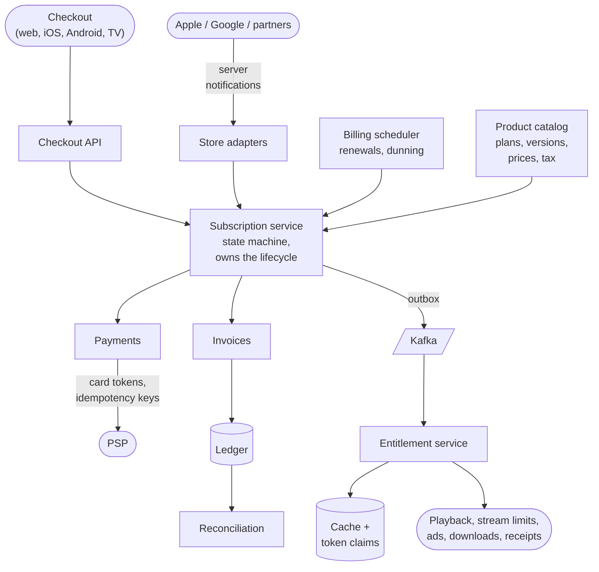

# Subscriptions, Bundles & Billing

**The prompt:** "Design subscriptions and billing for Disney+, Hulu and ESPN — plans, bundles, add-ons, trials, renewals, failed payments and app-store purchases — plus the entitlement service everything else reads." It tests state machines; **idempotency** (never charge twice); correctness under retries and out-of-order events; the line between **billing** and **entitlements**; and money-handling basics (integer money, ledgers, reconciliation). Related: [16 · stream limits](16_Concurrent_Stream_Limits.md) and [17 · video streaming](17_Disney_Plus_Video_Streaming.md) both read entitlements from here.

## Clarify first

**Products (US examples)**

- **Disney+ Basic** (with ads): up to 1080p, 2 simultaneous streams, no downloads.
- **Disney+ Premium** (no ads): 4K HDR, Dolby Atmos, 4 streams, downloads on up to 10 devices.
- **Bundles**, e.g. Disney+, Hulu and ESPN Unlimited together.
- **Add-ons:** Extra Member (paid sharing).
- Monthly and annual billing, free trials and promotions; prices differ by country, currency and tax rules.

**Functional**

- Subscribe on the web (card or wallet through a payment service provider, the PSP), in the iOS and Android apps (Apple and Google billing), on TV platforms, or through partners such as telecom bundles.
- Lifecycle: trial → active → renew every period; upgrade and downgrade; cancel (at period end); failed payment → retries, grace period, hold, expiry; refunds and chargebacks.
- **Entitlements:** what the account can do right now — which services, ad-free or not, top resolution, stream limit, downloads. Read by playback, stream limits, ads and downloads.
- Invoices and receipts, tax, price changes with notice, and a full history for support and audit.

**Non-functional**

- **Charging must be exactly right** — never twice, never lost. **Entitlement reads must always answer**, even when billing is down.
- Every operation idempotent and auditable (append-only history, a ledger).
- Keep PCI DSS scope minimal: card numbers never touch our servers.
- Scale: Disney+ and Hulu had 195.7M subscriptions at their last report (Sept 2025).

## Back-of-envelope

- **Renewals:** ~196M subscriptions, mostly monthly ÷ 30 days ≈ **6.5M renewals/day** ≈ 75/s on average. Tiny for a database — but they clump around month-start anchors, promo expiries and annual renewals, and every failure spawns retries.
- **Store notifications:** millions a day from Apple and Google (renewals, failures, refunds).
- **Entitlement reads:** every app launch and playback start → **10–100K/s** at peak. They must come from a cache or token claims, never from the billing database.
- **Ledger:** 2–4 entries per money movement → tens of millions of rows a day; partition by time.

## Architecture



| Service | Owns |
|---|---|
| Product catalog | Products, plan versions (price per country and currency, period, features), bundle composition, promotions — versioned and effective-dated |
| Subscription service | Each subscription's lifecycle and state machine; the source of truth for direct billing |
| Billing scheduler | Finding due renewals, creating invoices, triggering charges, dunning retries |
| Payments | The PSP integration: card tokens, idempotent charges, 3-D Secure / SCA flows |
| Store adapters | Apple, Google and partner integrations: verify purchases, mirror their state |
| Invoices, ledger, reconciliation | What was billed, the double-entry record of money, and daily matching against PSP and store reports |
| Entitlement service | What each account may do right now, served from a cache and token claims |

## Data model

```text
product            (product_id, kind PLAN|BUNDLE|ADDON, name)
plan_version       (plan_version_id, product_id, country, currency,
                    amount_minor, period P1M|P1Y, features,
                    effective_from, effective_to)  -- never edited in place
bundle_component   (bundle_product_id, component_product_id)
subscription       (sub_id, account_id, product_id, plan_version_id,
                    provider DIRECT|APPLE|GOOGLE|PARTNER, provider_ref,
                    status, period_start, period_end, anchor_day,
                    cancel_at_period_end, pending_change, next_billing_at,
                    claimed_until, version)
subscription_event (event_id, sub_id, type, payload, occurred_at)
                    -- append-only history
invoice            (invoice_id, sub_id, period_start, amount_minor, tax_minor,
                    currency, status,
                    UNIQUE (sub_id, period_start))       -- one per period
payment_attempt    (attempt_id, invoice_id, idempotency_key UNIQUE,
                    psp_ref, status, decline_code)
ledger_entry       (entry_id, txn_id, account_code, side DEBIT|CREDIT,
                    amount_minor, currency, created_at)
processed_event    (provider, event_id,
                    PRIMARY KEY (provider, event_id))    -- webhook dedupe
entitlement        (account_id, version, grants, computed_at)  -- read model
```

- Relational (Postgres/Aurora) for subscriptions, invoices, payments and the ledger: constraints and transactions matter more here than raw scale. Shard by `account_id` when one cluster isn't enough.
- Entitlements are a separate read model in a KV store behind a cache.
- **Money is integer minor units plus a currency** (cents, paise) — never floating point.

## The subscription state machine

| From | Event | To | Access? |
|---|---|---|---|
| PENDING | First charge succeeds | ACTIVE | Yes |
| PENDING | Trial starts | TRIALING | Yes |
| TRIALING | Trial ends, charge succeeds | ACTIVE | Yes |
| TRIALING | Cancelled during the trial, trial ends | EXPIRED | No |
| TRIALING or ACTIVE | Charge fails with a soft decline | PAST_DUE | Yes — grace period |
| PAST_DUE | A retry succeeds | ACTIVE | Yes |
| PAST_DUE | Retries exhausted, or a hard decline | ON_HOLD | No |
| ON_HOLD | The customer fixes the card and the charge succeeds | ACTIVE | Yes |
| ON_HOLD | The hold period ends | EXPIRED | No |
| ACTIVE | Cancel | ACTIVE with `cancel_at_period_end` | Yes, until the period ends |
| ACTIVE, cancelling | The period ends | EXPIRED | No |
| Any live state | Refund or chargeback | REVOKED | No |

Resubscribing after EXPIRED creates a **new** subscription — the old one's history stays intact.

## Key flows

### 1. Buying on the web

1. The browser hands the card to the PSP's hosted fields and gets back a **token**; we never see the card number, which keeps PCI scope small.
2. `POST /checkout {planVersionId, paymentToken, idempotencyKey}` → one database transaction: subscription (PENDING) + invoice (with tax) + an outbox event.
3. Charge through the PSP with idempotency key = `invoiceId`. 3-D Secure / SCA challenges bounce back to the browser and finish asynchronously.
4. The PSP's answer — synchronous, or by webhook, whichever arrives first — runs **one idempotent transition**: ACTIVE + ledger entries + `SubscriptionActivated` in the outbox, all in one transaction.
5. The outbox relay publishes to Kafka → the entitlement service recomputes → the cache updates → the app's next token refresh carries the new entitlements (or a push tells it to refresh now).

### 2. Renewals (direct billing)

A scheduler claims due subscriptions in small batches with a **lease**, so many workers can share the work and a crashed worker's batch gets retried:

```sql
UPDATE subscription
SET claimed_until = now() + interval '5 minutes'
WHERE sub_id IN (
    SELECT sub_id FROM subscription
    WHERE provider = 'DIRECT'
      AND status IN ('TRIALING', 'ACTIVE', 'PAST_DUE')
      AND next_billing_at <= now()
      AND (claimed_until IS NULL OR claimed_until < now())
    ORDER BY next_billing_at
    LIMIT 500
    FOR UPDATE SKIP LOCKED)      -- skip rows another worker is claiming right now
RETURNING sub_id;
```

- The claiming transaction is short, and the PSP calls happen **after** it commits — never hold row locks across a network call.
- For each subscription: insert the period's invoice (`UNIQUE (sub_id, period_start)` makes a second insert a no-op) → charge with key `renewal:{sub}:{periodStart}:{attempt}` (a network retry reuses the key; the next dunning attempt gets a new one) → apply the result.
- Regulation shapes this flow: EU Strong Customer Authentication and India's RBI e-mandate rules (pre-debit notifications, extra authentication for some recurring card charges) mean some renewals need a notice or a customer step first.

### 3. Failed payments (dunning)

- Classify the decline: **hard** (stolen card, closed account — don't retry, ask for a new card) or **soft** (insufficient funds, issuer unavailable — retry).
- Retry on a schedule (e.g. days 1, 3, 5, 7), timed for when charges tend to succeed; card-network account updaters refresh expired cards automatically.
- Keep access through a **grace period** — most failures are involuntary, and the customer still wants the service — then **hold** (no access, one tap to fix the card), then expire. Tell the customer at every step, in the app and by email.

### 4. App-store purchases (Apple, Google)

- The store is the merchant of record: it charges, renews and retries. Our job is to **link, verify, mirror and entitle**.
- **Link** the purchase to the MyDisney account: pass `appAccountToken` (Apple) or `obfuscatedExternalAccountId` (Google) when the purchase starts; the store echoes it back in every transaction.
- **Verify on the server**, never trusting the app: Apple's App Store Server API (the old `verifyReceipt` endpoint is deprecated) and Google's `purchases.subscriptionsv2`. Google also requires you to **acknowledge a purchase within three days**, or it's refunded automatically.
- **Mirror state from server notifications:** Apple's App Store Server Notifications V2 (`SUBSCRIBED`, `DID_RENEW`, `DID_FAIL_TO_RENEW`, `EXPIRED`, `REFUND`, …) and Google's Real-time Developer Notifications over Pub/Sub (`SUBSCRIPTION_RENEWED`, `SUBSCRIPTION_IN_GRACE_PERIOD`, `SUBSCRIPTION_ON_HOLD`, `SUBSCRIPTION_EXPIRED`, …). Treat each one as a **hint**: fetch the current state from the store's API and upsert it. That absorbs duplicates, out-of-order delivery and missed notifications; a daily reconciliation job catches the rest.
- You can't cancel a customer's Apple subscription for them. Google lets the developer cancel or revoke through its API.

### 5. Upgrades, downgrades and bundles

- **Upgrade** (Basic → Premium) mid-period: entitlements change immediately. Either charge the price difference for the remaining fraction of the period (proration — code below) or charge the new price and restart the period. Pick one and say why.
- **Downgrade:** at period end — store it as `pending_change` and apply it at renewal. The customer keeps what they paid for, and there's no refund maths.
- **Buying the bundle while holding standalone Disney+:** start the bundle, cancel the standalone with a prorated credit on the bundle's first invoice, and keep entitlements as the union during the switch so there's no gap.
- **Bundle accounting:** one charge, but the ledger allocates the revenue across Disney+, Hulu and ESPN (by standalone selling prices) — accounting rules require it.

### 6. Price changes

- Never edit a price in place. Create a new `plan_version` with an effective date, and move subscriptions at their first renewal after the notice period.
- Some regions and app stores require the customer's **consent** to an increase: track consent per subscription, and cancel at period end if it never comes. Grandfathering = leaving some subscriptions on the old version.

### 7. The entitlement service

- **Input:** every active grant for the account — direct and app-store subscriptions, partner bundles, add-ons, promos, employee comps.
- **Merge per service, best tier wins:** services union; stream limit, resolution → max; ad-free, downloads → OR (code below).
- **Output:** a versioned snapshot `(account, version, grants)` in a KV store and cache, plus a compact copy in access-token claims with a short TTL (e.g. 15 minutes).
- **Propagation:** subscription event → recompute → bump the version → tell devices to refresh (a push, or the next API response says "entitlements changed"). Revocations (refunds, chargebacks) can also be enforced at the next license renewal.
- **Availability:** entitlement reads never touch the billing database, so a billing outage stops nobody watching.

### 8. Ledger and reconciliation

- **Double-entry:** every money movement is a transaction whose debits equal its credits. A $10 monthly charge: debit *cash at PSP* $10, credit *deferred revenue* $10; over the month, deferred revenue moves to *revenue*. A refund posts the reverse — entries are never edited or deleted.
- **Reconciliation:** every day, match PSP settlement reports and app-store financial reports against payment attempts and the ledger; mismatches go to a finance-ops queue.

## LLD

States and legal transitions:

```java
public enum SubStatus {
    PENDING, TRIALING, ACTIVE, PAST_DUE, ON_HOLD, EXPIRED, REVOKED;

    private static final Map<SubStatus, Set<SubStatus>> NEXT = Map.of(
            PENDING,  EnumSet.of(TRIALING, ACTIVE, EXPIRED),
            TRIALING, EnumSet.of(ACTIVE, PAST_DUE, EXPIRED, REVOKED),
            ACTIVE,   EnumSet.of(PAST_DUE, EXPIRED, REVOKED),
            PAST_DUE, EnumSet.of(ACTIVE, ON_HOLD, EXPIRED, REVOKED),
            ON_HOLD,  EnumSet.of(ACTIVE, EXPIRED, REVOKED),
            EXPIRED,  EnumSet.noneOf(SubStatus.class),     // resubscribing creates a new subscription
            REVOKED,  EnumSet.noneOf(SubStatus.class));

    public boolean canMoveTo(SubStatus to) { return NEXT.get(this).contains(to); }
    public boolean grantsAccess() { return this == TRIALING || this == ACTIVE || this == PAST_DUE; }
}
```

Money and proration:

```java
public record Money(long minor, Currency currency) {}      // cents, paise — never double

/** Upgrade mid-period: charge the price difference for the time that's left. */
static Money prorateUpgrade(Money oldPrice, Money newPrice, Instant now,
                            Instant periodStart, Instant periodEnd) {
    if (!oldPrice.currency().equals(newPrice.currency())) throw new IllegalArgumentException("currency mismatch");
    long total = Duration.between(periodStart, periodEnd).toSeconds();
    long left = Duration.between(now, periodEnd).toSeconds();
    BigDecimal owed = BigDecimal.valueOf(newPrice.minor() - oldPrice.minor())
            .multiply(BigDecimal.valueOf(left))
            .divide(BigDecimal.valueOf(total), 0, RoundingMode.HALF_UP);    // round once, at the end
    return new Money(Math.max(0, owed.longValueExact()), newPrice.currency());
}
```

Merging entitlements — best tier wins, per service:

```java
public record Features(boolean adFree, Resolution maxResolution, int maxStreams, boolean downloads) {
    static Features best(Features a, Features b) {
        return new Features(a.adFree() || b.adFree(),
                            Resolution.max(a.maxResolution(), b.maxResolution()),
                            Math.max(a.maxStreams(), b.maxStreams()),
                            a.downloads() || b.downloads());
    }
}

public Map<Service, Features> merge(List<Grant> activeGrants) {     // a subscription, add-on or promo
    Map<Service, Features> out = new EnumMap<>(Service.class);
    for (Grant g : activeGrants) {
        g.features().forEach((service, f) -> out.merge(service, f, Features::best));
    }
    return out;
}
```

Per service rather than per account: a bundle's tiers can differ by service, and each service enforces its own limits.

One interface, several billing providers (Strategy / Adapter):

```java
public interface BillingProvider {
    Provider type();                                                // DIRECT, APPLE, GOOGLE, PARTNER
    VerifiedPurchase verify(String accountId, String purchaseToken);   // server-side; never trust the app
    StoreState fetchState(String providerRef);                      // source of truth for store-billed subs
    void cancelAtPeriodEnd(String providerRef);                     // Apple: unsupported → guide the customer
}
```

Handling a store notification — the network call outside the transaction; dedupe, state change and outbox inside it:

```java
public void onStoreNotification(StoreNotification n) {
    if (processedEvents.exists(n.provider(), n.eventId())) return;             // cheap early exit
    StoreState truth = providers.get(n.provider()).fetchState(n.providerRef());   // don't trust arrival order
    tx.executeWithoutResult(status -> {                                         // a TransactionTemplate
        if (!processedEvents.insertIfAbsent(n.provider(), n.eventId())) return;   // lost a race: already done
        Subscription sub = subscriptions.findByProviderRef(n.provider(), n.providerRef())
                .orElseGet(() -> Subscription.fromStore(truth));
        sub.syncWith(truth);                  // applies only newer state; checks canMoveTo()
        subscriptions.save(sub);              // @Version: optimistic lock against a parallel handler
        outbox.add(SubscriptionChanged.of(sub));   // relayed to Kafka after commit
    });
}
```

- The store API call happens **before** the transaction opens: never hold a database transaction open across a network call (the long-transaction problem in [09_Database_Transactions.md](../Java_SpringBoot/09_Database_Transactions.md)).
- `TransactionTemplate` rather than `@Transactional` on a helper method in the same class: a call on `this` bypasses Spring's proxy, so the annotation would be silently ignored (the self-invocation trap in [05_Spring_Core_DI_AOP.md](../Java_SpringBoot/05_Spring_Core_DI_AOP.md)).
- `insertIfAbsent` is `INSERT … ON CONFLICT DO NOTHING`, returning whether a row was inserted.

## Failure modes

| Failure | Risk | Handling |
|---|---|---|
| The PSP times out mid-charge | Unknown: charged or not? | Mark the attempt UNKNOWN; retry with the **same** idempotency key, or look the payment up by reference; reconcile |
| A webhook is delivered twice | Double processing | The `processed_event` primary key |
| Notifications arrive out of order | EXPIRED applied after a newer renewal | Fetch the current state from the store and apply only newer state |
| A worker dies mid-batch | Renewals skipped or repeated | Its claims expire and another worker retries; invoice uniqueness and idempotency keys make repeats harmless |
| The billing database is down | No sign-ups or renewals | Entitlements are still served from the snapshot; renewals catch up later |
| The entitlement service is down | Changes can't be recomputed | Token claims and cached snapshots keep answering |
| Kafka lags | An upgrade takes a while to apply | Checkout triggers a direct entitlement refresh for that account |

## Trade-offs to say out loud

- **Proration vs simplicity:** exact proration is fairer; "change at period end" is simpler and avoids refunds. Upgrades at once and downgrades at period end is a common split.
- **Grace-period length:** longer keeps more customers (most failures are involuntary) but gives away more free service.
- **Entitlements in tokens:** fast and resilient, but a change can take up to one token lifetime unless you push invalidations.
- **Direct vs app-store billing:** app stores bring conversion and handle payments, but take a commission and own the billing relationship — you can't cancel or refund an Apple subscription yourself.
- **One relational database vs sharding:** start with one per region and constraints everywhere; shard by account when you have to.

## Trick questions

- **"Why not store money as a double?"** — Binary floating point can't represent 0.10 exactly, and the errors accumulate across millions of rows. Use integer minor units (or `BigDecimal`), and remember currencies differ: JPY has no minor unit; KWD has three decimals.
- **"The PSP call timed out. Did we charge them?"** — Unknown. Don't retry with a new key — that's how double charges happen. Retry with the same key (the PSP returns the original result) or look the payment up; until then the attempt is UNKNOWN.
- **"The webhook arrives before the checkout redirect comes back."** — Both paths run the same idempotent transition; whichever arrives second is a no-op. The redirect page just polls the status.
- **"Apple says EXPIRED, then an older DID_RENEW arrives."** — Don't apply notifications in arrival order: fetch the current state from the App Store Server API and compare timestamps.
- **"They pay for Disney+ on an iPhone and for the bundle on the web."** — Entitlements are the union, so nothing breaks. Detect the overlap and tell them to cancel in Apple's settings — you can't cancel it for them.
- **"How do you stop two renewals for the same month?"** — `UNIQUE (sub_id, period_start)` on invoices, an idempotency key per charge attempt, and lease-based claims so two workers never process the same subscription at once.
- **"Someone subscribes on January 31. When do they renew?"** — Store the anchor day (31) separately from the next billing date: Feb 28 (29 in a leap year), then Mar 31. If you only store "last date + 1 month", you drift to the 28th forever.
- **"Stop free-trial abuse."** — One trial per payment instrument (the PSP's card fingerprint), per device and per account, plus velocity checks.
- **"Billing is down. Can people watch?"** — Yes: entitlements come from token claims and the snapshot, never from billing.
- **"A chargeback comes in."** — Revoke access (or let it run to period end, by policy), post the reversal and the fee to the ledger, and flag the account for risk.
- **"How do you know the ledger is right?"** — Every transaction balances (debits = credits), entries are immutable, and daily reconciliation against PSP and store reports finds what's missing.
- **"How does the entitlement service see every change exactly once?"** — It doesn't need exactly-once: the outbox gives at-least-once delivery, and the consumer is idempotent because it recomputes from the source and stores a version.

## Similar systems

| System | What changes |
|---|---|
| Stripe Billing | Essentially this design as a product: prices, subscriptions, invoices, dunning, idempotency keys on every write |
| Netflix | Direct billing plus many partner bundles (telecoms, TV operators) whose entitlements arrive by partner API |
| SaaS seat billing (Slack, GitHub) | Quantities change mid-period, so every seat added or removed is prorated |
| Telecom postpaid, and prepaid recharges in India | Usage-based rating, prepaid balances, far higher event volumes |
| Apple and Google in-app subscriptions | They run this whole system for you; you mirror it |
| One-off checkout and payments (tracker #31) | The same idempotency and ledger ideas, without the renewal state machine |

## Commonly asked

- Draw the subscription state machine. Which states grant access?
- How do renewals work at scale without ever charging twice?
- What happens when a payment fails?
- How do Apple and Google subscriptions fit in, and what's the source of truth?
- What's the difference between a subscription and an entitlement?
- How do upgrades, downgrades and bundles work? Show the proration.
- Why a ledger, and what does double-entry mean?
- The PSP times out mid-charge. What now?

## Sources

- [Disney+ plans: Basic vs Premium (Digital Trends)](https://www.digitaltrends.com/home-theater/what-is-disney-plus-plans-pricing-more/) · [195.7M Disney+ and Hulu subscriptions in the final report (AV Club)](https://www.avclub.com/disney-gained-streaming-subscribers-kimmel-q4-2025)
- [Acknowledge within three days or the purchase is refunded (Android Developers)](https://developer.android.com/google/play/billing/lifecycle/one-time)
- [Validating receipts with the App Store (Apple)](https://developer.apple.com/documentation/storekit/validating-receipts-with-the-app-store) · [verifyReceipt deprecation (Apple Developer Forums)](https://developer.apple.com/forums/thread/731550)
