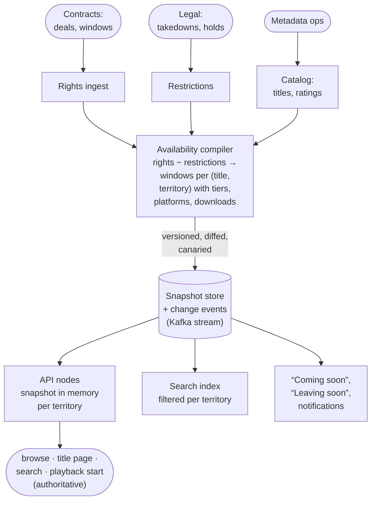

# Catalog, Rights & Availability

**The prompt:** "Design the catalog for Disney+: what titles exist, and which of them each viewer can see and play *right now* — given their country, the date, their plan, their device and their profile." Disney's catalog really does differ by country: outside the US, the Hulu tile inside Disney+ replaced Star in October 2025 — except in Japan, where Disney doesn't own the Hulu brand, so the tile is still Star — and in the US, Hulu is folding into a single Disney+ app by the end of 2026. It tests the difference between **rights** (contract facts) and **availability** (a precomputed answer), time windows and time zones, precomputing vs evaluating at request time, keeping browse, search and playback consistent, and pulling a title everywhere within minutes. Related: [17 · Disney+ video streaming](17_Disney_Plus_Video_Streaming.md) (the play-time check), [19 · live sports](19_Live_Sports_Streaming.md) (blackouts), [33 · media ingest](33_Media_Ingest_Transcoding.md) (where titles come from), [30 · subscriptions](30_Subscriptions_Billing.md) (plans).

## Clarify first

**Functional**

- **Catalog:** titles (movies; series → seasons → episodes; extras), localized metadata (names, synopses, artwork per language), credits, genres, brand (Disney, Pixar, Marvel, Star Wars, National Geographic, Hulu), **maturity ratings per country**, versions (e.g. a territory-specific edit).
- **Rights:** licenses per territory with a window (start, end), what they permit (streaming, downloads), which plans and devices, exclusivity. Disney-owned titles usually have broad rights; licensed titles narrow ones.
- **Availability queries:** can this viewer see or play title T now? Asked by every row, search result, title page, playback start and download renewal.
- **Scheduled changes:** "Coming soon" and "Leaving soon" rows; launches at a precise moment.
- **Takedowns:** legal or emergency removal within minutes.
- **Events** when availability changes: notifications, search updates, recommendations.

**Non-functional**

- **Reads:** every page, row, search and play → **100K+ checks/s** at peak, each well under a millisecond (in process).
- **Correctness:** never play outside the rights — that's a contract breach — so the play-time check is authoritative. Browse may be seconds stale; takedowns must land within minutes.
- **Size:** assume ~100K titles (episodes count) × ~150 territories × a few plan tiers and device classes.
- **Auditability:** "why was T available in France on this date?" must have an answer.

## Back-of-envelope

- **(title, territory) pairs:** 100K × 150 = **15M**. With 1–3 windows each at ~30–50 bytes, that's under 1 GB for the world — and one territory is ~100K entries, **~10 MB**. Every API node can hold its territories in memory.
- **Reads:** 100K+/s become in-memory lookups — microseconds, no network hop, so it's safe to check every tile on every page.
- **Changes:** new deals and window boundaries mean thousands of changes a day — tiny next to the reads. That asymmetry is the whole design: **precompute on write, look up on read**.

## API

```text
GET  /v1/catalog/titles/{id}?lang=fr-FR&territory=FR      metadata, edge-cached
GET  /v1/availability/{titleId}?territory=FR&tier=BASIC&platform=TV
     → { playable, downloadable, until, nextChange }
POST /v1/availability/batch    { titleIds, territory, tier, platform }  (rows)

Internal:
POST /v1/rights                from the contracts system (deals, windows)
POST /v1/restrictions          takedowns and holds:
                               { titleId, territories, from, until, reason }

Events: AvailabilityChanged(titleId, territory, window)
        TitleTakenDown(titleId, territories)
```

## Data model

```text
title           (title_id, kind, parent_id, season_no, episode_no, brand,
                 duration)
localization    (title_id, lang, name, synopsis, artwork_ids)
rating          (title_id, country, system, rating)              per country
right           (right_id, scope_id (series, season or title), territory,
                 start_utc, end_utc, stream, download, tiers, platforms,
                 exclusive, contract_ref)                         the input
restriction     (title_id, territory, kind TAKEDOWN|HOLD, from_utc, until_utc,
                 reason)
availability    (territory, version, entries: title_id → windows) the output
```

- **Rights are the input, availability is the output.** Rights are contract facts — hierarchical, overlapping, messy. Availability is a compiled, non-overlapping list of windows per (title, territory), each carrying flags for tiers, platforms and downloads. The playback path never reads a contract.
- **Rights can be granted at series or season level** and inherited by episodes, with episode-level exceptions; the compiler flattens all of that to episodes.
- **Every instant is stored in UTC.** "Available from 1 October in France" is converted to the UTC instant of midnight in Paris *when the right is ingested*, using time-zone rules (daylight saving included). For countries spanning several time zones, the contract names the reference zone.

## Architecture



## Deep dives

### 1. Rights vs availability — the core modeling decision

- A right: "title T, territory FR, streaming and downloads, 1 Jan 2026 → 31 Dec 2027, all plans, exclusive." Many rights can exist per title, overlapping, at different levels of the hierarchy.
- Availability: for (T, FR), a sorted list of non-overlapping windows with flags. Checking it is a binary search for "now".
- The **compiler** runs on every change to rights or restrictions — incrementally, recomputing only the affected (title, territory) pairs — and a full nightly rebuild runs alongside and is compared with the incremental result, alerting on any drift.

### 2. Time and boundaries

- **Nothing has to run at midnight.** A snapshot entry already contains its window's UTC start and end, so a title "becomes available" the moment a check compares `now` against it. The only thing that must happen in advance is distributing a snapshot that contains the future window.
- **Cache pages until the next boundary:** a page's TTL is the smaller of the default and the time until the next window change for anything on it — so "Coming soon" flips to "Watch now" on time.
- A global premiere at one instant and a rollout at local midnight in each country are the same thing to the system: UTC instants in windows.
- **Time-zone rules change** (countries adjust daylight saving): windows are recompiled when the time-zone database updates.

### 3. The serving path

- Each API node holds the snapshots for the territories it serves in memory and swaps in a new version atomically. A check is a map lookup plus a binary search over one to three windows.
- Rows and search results are filtered at request time with the same in-memory check (search indexes can also be pre-filtered per territory, with the request-time check as the final word around boundaries).
- Metadata pages are edge-cached per (territory, language, tier), with TTLs capped at the next boundary.
- **Consistency:** a tile can appear seconds early or late around a boundary; the **playback check is authoritative**, and the license server re-checks when it issues a license.

### 4. Takedowns — the urgent path

- A court order must take a title down within minutes: a restriction starting *now* goes through the compiler's fast lane, bypassing batching. In parallel, a small **deny list** is pushed to every node and checked before the snapshot — the fastest path of all.
- Then: purge the affected pages from the CDN, and have the license server refuse new licenses *and renewals* for the title, which stops in-progress playback within one license lifetime ([note 16](16_Concurrent_Stream_Limits.md)).

### 5. Plans, devices and profiles

- **Tiers and platforms:** rights can differ by what's allowed — streaming vs downloading, certain devices, certain plans — so windows carry those flags and the check matches them against the viewer.
- **Maturity:** ratings differ by country (a film's US rating and its rating in another country can differ), so a profile's content setting maps onto each country's rating system.
- **Brand tiles are presentation:** the Hulu tile shows different titles in different countries, and in Japan it's still called Star. Availability decides what's inside a tile; the brand only groups it.

### 6. Safety: bad data is the biggest risk

- A bad contract import could make thousands of titles vanish from a country — or appear where they aren't licensed. **Diff every new snapshot against the current one** before publishing; a large diff ("12,000 titles disappear from Brazil") blocks publication and pages a human.
- Snapshots are immutable and versioned, so a **rollback** is instant: re-install the previous version. Roll new snapshots out to a canary set of nodes first.
- **Provenance:** every window records which rights produced it, so "why is T available in France?" has an answer.

### 7. Where is the viewer?

- The territory comes from IP geolocation checked against the account's country, with VPN and proxy detection as a contractual "reasonable effort".
- **EU portability:** since 1 April 2018, EU subscribers temporarily in another EU country must get their home country's content (Regulation (EU) 2017/1128) — so for them the territory is their country of residence, not their IP's country. The residence-check data may be kept only as long as the check needs it.

## LLD

A window, and a per-territory snapshot with the binary search:

```java
public record Window(Instant start, Instant end, Set<Tier> tiers, Set<Platform> platforms,
                     boolean download) {}

/** Immutable. Per title: windows sorted by start, never overlapping. */
public final class TerritorySnapshot {
    private final long version;
    private final Map<String, Window[]> byTitle;

    public Optional<Window> activeWindow(String titleId, Instant now) {
        Window[] ws = byTitle.get(titleId);
        if (ws == null) return Optional.empty();
        int lo = 0, hi = ws.length - 1;                  // find the last window starting at or before now
        while (lo <= hi) {
            int mid = (lo + hi) >>> 1;
            if (ws[mid].start().isAfter(now)) hi = mid - 1; else lo = mid + 1;
        }
        return hi >= 0 && now.isBefore(ws[hi].end()) ? Optional.of(ws[hi]) : Optional.empty();
    }

    public long version() { return version; }
}
```

The compiler — rights minus restrictions, split at every boundary, flags merged:

```java
List<Window> compile(List<Right> rights, List<Restriction> restrictions) {
    TreeSet<Instant> cuts = new TreeSet<>();
    rights.forEach(r -> { cuts.add(r.start()); cuts.add(r.end()); });
    restrictions.forEach(x -> { cuts.add(x.from()); cuts.add(x.until()); });

    List<Window> out = new ArrayList<>();
    Instant prev = null;
    for (Instant cut : cuts) {                                  // each [prev, cut) lies wholly inside
        if (prev != null) {                                     // or wholly outside every right
            Instant a = prev, b = cut;
            boolean blocked = restrictions.stream().anyMatch(x -> x.covers(a, b));
            List<Right> live = rights.stream().filter(r -> r.covers(a, b)).toList();
            if (!blocked && !live.isEmpty()) out.add(Window.union(a, b, live));   // OR the flags
        }
        prev = cut;
    }
    return coalesce(out);                                       // join neighbours with identical flags
}
```

Local midnight to UTC, with daylight saving handled by the time-zone rules:

```java
Instant localMidnight(LocalDate date, ZoneId territoryZone) {
    return date.atStartOfDay(territoryZone).toInstant();
}
// localMidnight(LocalDate.of(2026, 10, 1), ZoneId.of("Europe/Paris")) → 2026-09-30T22:00:00Z
```

The in-memory cache on each API node — a deny list checked first, and snapshots that can never go backwards:

```java
public final class AvailabilityCache {
    private final ConcurrentHashMap<String, AtomicReference<TerritorySnapshot>> byTerritory = new ConcurrentHashMap<>();
    private final Set<String> denied = ConcurrentHashMap.newKeySet();     // "titleId|territory" or "titleId|*"

    public boolean playable(String titleId, String territory, Tier tier, Platform platform, Instant now) {
        if (denied.contains(titleId + "|*") || denied.contains(titleId + "|" + territory)) return false;
        AtomicReference<TerritorySnapshot> ref = byTerritory.get(territory);
        return ref != null && ref.get().activeWindow(titleId, now)
                .filter(w -> w.tiers().contains(tier) && w.platforms().contains(platform))
                .isPresent();
    }

    /** Installed from the change stream; a late-arriving older version never wins. */
    public void install(String territory, TerritorySnapshot next) {
        byTerritory.computeIfAbsent(territory, t -> new AtomicReference<>(next))
                .accumulateAndGet(next, (cur, nxt) -> nxt.version() > cur.version() ? nxt : cur);
    }
}
```

A page's cache lifetime, capped at the next change:

```java
Duration ttl(Instant now, Optional<Instant> nextBoundary, Duration max) {
    return nextBoundary.map(b -> Duration.between(now, b))
                       .filter(d -> d.compareTo(max) < 0)
                       .orElse(max);
}
```

## Failure modes

| Failure | Effect | Handling |
|---|---|---|
| A bad contract import | Titles vanish, or appear unlicensed | Snapshot diff guard, canary rollout, instant rollback to the previous version |
| A compiler bug | Wrong windows | The nightly full rebuild is compared with the incremental result; alert on drift |
| Snapshot distribution lags | A node serves an older version | Windows carry their own instants, so boundaries stay correct; takedowns use the deny list |
| API node clock skew | Boundaries off by a few seconds | NTP; the license server's check is authoritative |
| Metadata service down | Pages can't be rebuilt | Edge caches keep serving; availability doesn't depend on it |
| The time-zone database changes | Local-midnight windows shift | Recompile the windows derived from local times |

## Trade-offs to say out loud

- **Precompute vs evaluate at request time:** precomputing makes reads trivial and safe to call everywhere, at the cost of a compiler and snapshot distribution. Evaluating contracts on every request is slow and fragile.
- **Snapshot in every node vs a central service:** zero-latency and no dependency vs more memory and a distribution pipeline — at ~10 MB per territory, easily worth it.
- **Filter search at index time vs query time:** faster queries vs freshness around boundaries; do both, with the query-time check as the final word.
- **Strictness around boundaries:** show a tile a few seconds early (the playback check still blocks it) vs waiting for exact alignment everywhere.

## Trick questions

- **"A title becomes available at midnight in France. What runs at midnight?"** — Nothing. The snapshot already holds the window's UTC start; checks compare it with the clock. The work happened earlier: distributing the snapshot and capping cache lifetimes at the boundary.
- **"Midnight where? The US has six time zones."** — The contract names the reference zone; it's stored as a UTC instant, with daylight saving handled when it's converted.
- **"The home page shows a tile, but Play says 'not available'."** — A cached page near a boundary. The playback check is authoritative; cap page TTLs at the next boundary so it lasts seconds, not hours.
- **"A court orders a title removed in Germany within 30 minutes."** — Deny-list push to every node, a fast-lane snapshot, a CDN purge, and the license server refusing renewals.
- **"A bad import wipes half of Brazil's catalog."** — The diff guard blocks it before it ships; if something slips through, roll back to the previous immutable snapshot.
- **"Why not query the rights database at play time?"** — 100K+ checks a second against complex, hierarchical contract logic is slow and fragile. Compile it once; look it up in memory.
- **"A French subscriber opens the app in Spain."** — In the EU, they get the French catalog: the portability regulation makes the country of residence, not the IP, decide.
- **"A kids profile — which rating applies?"** — The rating in the viewer's country; the profile's setting maps onto each country's rating system.
- **"Search shows titles that aren't available here."** — Filter results with the same in-memory check at query time.
- **"A series-level deal excludes one episode."** — Rights are hierarchical with exceptions; the compiler flattens them to episodes.

## Similar systems

| System | What changes |
|---|---|
| Netflix | The same problem across 190+ countries: rights compiled into per-country availability |
| Spotify | Per-country track licensing — the greyed-out tracks — the same compile step |
| Apple App Store, Google Play | App availability, pricing and age ratings per country |
| Amazon marketplaces | Whether a product can ship to a country: rules compiled into eligibility |
| YouTube Content ID | Rights holders choose, per video, where it's blocked or monetized |

## Commonly asked

- What's the difference between a right and availability, and why store both?
- How do you make a title available at exactly midnight in each country?
- A check runs on every tile of every page. How do you make it cheap?
- How do you take a title down everywhere within minutes?
- How do you stop a bad data import from wiping out a country's catalog?
- Which catalog does a traveller see?

## Sources

- [Hulu replaces Star as a tile on Disney+ outside the US (Deadline)](https://deadline.com/2025/10/hulu-international-tile-launch-date-revealed-1236568467/) · [Disney reveals when Hulu replaces Star (What's On Disney Plus)](https://whatsondisneyplus.com/disney-reveals-when-hulu-will-replace-star-on-disney-internationally/)
- [Hulu and Disney+ combining into one app (CBS News)](https://www.cbsnews.com/news/hulu-disney-plus-app/)
- [The EU portability regulation takes effect (Library of Congress)](https://www.loc.gov/item/global-legal-monitor/2018-04-10/european-union-regulation-on-cross-border-portability-of-online-content-services-in-effect/)
