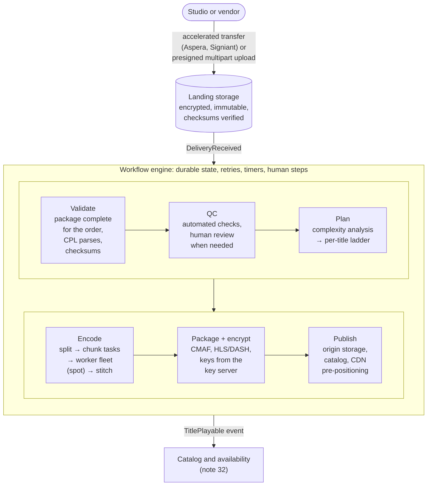

# Media Ingest & Transcoding Pipeline

**The prompt:** "Design the pipeline that takes a studio's master files and turns them into streams for Disney+, Hulu and partners." This is the "digital media supply chain" that Disney's Bengaluru media-technology roles build. It tests moving huge files, **long-running workflows that resume instead of restarting**, splitting one job across thousands of machines, idempotency, priorities and cost, quality control, and versioning — plus security, because the content is unreleased. Related: [17 · Disney+ video streaming](17_Disney_Plus_Video_Streaming.md) (what this pipeline produces), [32 · catalog & rights](32_Catalog_Rights_Availability.md) (what happens once a title is ready), [19 · live sports](19_Live_Sports_Streaming.md) (replays enter here).

## Clarify first

**Functional**

- **Receive deliveries** from studios and vendors: IMF packages (the industry's master format), older ProRes/MXF files, audio stems per language, subtitles and captions, artwork and metadata — and check them against the **order** (which versions and languages were expected, by when).
- **QC:** automated checks on every delivery, human review for premium titles.
- **Encode:** per-title ladders across codecs and HDR formats; audio encodes (AAC, Dolby Digital Plus, Atmos); subtitle conversion.
- **Package and encrypt:** CMAF segments, HLS and DASH manifests, DRM keys from the key server.
- **Publish:** to origin storage, register the renditions in the catalog, pre-position premieres on CDNs, announce "playable".
- **Versions:** re-deliveries of fixed masters, new languages added later, territory-specific edits.
- **Library re-encodes** (a new codec, a better ladder) as low-priority background work.
- **Tracking:** a status page per title and order — step, failures, ETA against the due date.

**Non-functional**

- **Throughput:** assume a few hundred hours of new content a day, plus library backfill.
- **Turnaround:** a late master for a premiere must be ready in hours, so priority lanes.
- **Durability:** never lose a master; checksums end to end.
- **Security:** unreleased content — encryption at rest, least privilege, audit trails, watermarked review copies, nothing public.
- **Cost:** encoding compute is the big bill — cheap spot capacity, no rework.
- **Resumable and idempotent:** any step can crash and restart without redoing hours of work or producing duplicates.

## Back-of-envelope

- **Masters are big:** a 4K HDR master at ~200–500 Mbps is ~180–450 GB for a 2-hour film, before audio stems. Even at 1 Gbps that's 25 minutes to an hour to transfer.
- **Daily ingest:** ~200 hours × 3,600 s × ~400 Mbps ÷ 8 ≈ **36 TB/day** of masters.
- **Encoding is slow:** one high-quality 4K rendition encodes far slower than real time on a single machine, and a title needs ~6–12 renditions per codec across 2–3 codec families (AV1 being the slowest). That's **thousands of core-hours per film**.
- **Hence chunking:** split a 2-hour film into ~1-minute chunks → ~120 chunks × ~30 renditions ≈ 3,600 independent tasks. Spread across a few thousand cores, the wall-clock time drops to under an hour.
- **Outputs:** ~100–150 GB of renditions per film ([note 17](17_Disney_Plus_Video_Streaming.md)).

## API

```text
POST /v1/orders                     { titleId, version, deliverables,
                                      dueAt, priority }
POST /v1/deliveries                 { orderId, manifest }
                                    → presigned multipart upload URLs
POST /v1/deliveries/{id}/complete   { checksums } → starts the workflow
GET  /v1/workflows/{id}             steps, status, attempts, ETA vs due date
POST /v1/workflows/{id}/signal      e.g. REDELIVERED, QC_APPROVED (human steps)

Events: DeliveryReceived · QcFailed(details) · EncodeCompleted
        TitlePlayable(titleId, version, renditionSetId)
```

## Data model

```text
order         (order_id, title_id, version, deliverables, due_at, priority,
               status)
asset         (asset_id, kind VIDEO|AUDIO|SUBTITLE|ART, language, sha256,
               storage_uri, delivery_id)                          immutable
composition   (comp_id, title_id, version, cpl_ref, asset_ids)  one playable cut
task          (task_id, workflow_id, step, input_hash, params_hash, status,
               attempts, lease_until, output_uri)
output        (output_key = hash(inputs + params + encoder version), uri)
rendition_set (set_id, title_id, comp_id, codecs, ladder, key_ids,
               manifest_uris, status)
```

- **Assets are immutable and content-addressed:** a re-delivery is a new asset, never an overwrite.
- **`output` is a cache keyed by everything that determines the bytes** — rerunning a step with identical inputs costs nothing. That's the idempotency mechanism *and* the cost saver.
- **Lineage:** every rendition points back to its composition and assets, so "which renditions used the bad master?" is a query, not an investigation.

## Architecture



## Deep dives

### 1. Getting huge files in

- **Never through your API servers.** Presigned multipart uploads go straight to object storage, parts in parallel, resumable part by part; or the accelerated transfer tools the industry already uses.
- **Checksums** for every file (and every part), supplied by the sender and verified on arrival — fail within minutes, not after hours of encoding.
- **IMF (SMPTE ST 2067):** a **composition playlist (CPL)** describes one version of a title and references track files by ID. A *supplemental* package — French audio, a fixed reel — references tracks that were delivered before, so one playable composition can be assembled from several deliveries. "Is the order complete?" = every track the CPL references is present and its checksum matches.

### 2. Why a workflow engine, not a chain of queues

- Each title version runs a **durable workflow** (Temporal, AWS Step Functions and Netflix's Conductor are this kind of engine): its state is saved after every step, each step is an idempotent activity with timeouts, retries and backoff, and long steps send heartbeats so a dead worker is noticed in minutes.
- With queues alone you'd rebuild all of that by hand — plus timers ("the vendor has 48 hours to redeliver"), human steps (QC approval as a signal), and one place to answer "where is episode 5 of that series?".
- **Fan-out and fan-in:** encoding is thousands of chunk tasks, then a wait for all of them, then a stitch. Stragglers are re-run speculatively on another machine (MapReduce's backup tasks), and the first result wins.

### 3. Chunked parallel encoding

- **Split at scene cuts or GOP boundaries** (closed GOPs), encode each chunk for every rendition independently, stitch. Keyframes must line up across renditions at segment boundaries, or the player can't switch bitrate ([note 17](17_Disney_Plus_Video_Streaming.md)).
- **Chunk size is a trade-off:** too small and the encoder loses context (quality dips at the seams) and overhead grows; too big and parallelism suffers and a retry redoes more work. Tens of seconds to a few minutes; shot-based splitting is the refined version.
- **Spot capacity fits:** chunk tasks are short, so a reclaimed machine loses little. A worker holds a **lease** on its task; if the lease lapses, another worker takes it.
- **Per-title ladders:** a quick analysis encode measures complexity, and quality metrics (VMAF) pick the ladder — fewer bits for animation, more for film grain.
- **CPU vs GPU encoders:** software encoders give the best quality per bit (so the lowest egress bill); GPUs give the fastest turnaround. Premieres on a deadline can take the faster path first and be improved later.

### 4. Idempotency and "never pay twice"

- The output key is a hash of everything that determines the bytes: input checksum, time range, encoding parameters, encoder version. If the output exists, the task returns it immediately — crashed retries, reruns and duplicate deliveries are free.
- Side effects are upserts keyed by ID (register rendition X), and events carry IDs so consumers can dedupe.
- A rendition set becomes **playable atomically**: the catalog flips to it only when every rendition, manifest and key is in place — never half a ladder.

### 5. Priorities and cost

- **Lanes:** premieres and day-and-date releases → new episodes → re-deliveries → library backfill. Weighted fair scheduling, so backfill always moves but never blocks a premiere; a rush can preempt backfill tasks (they're idempotent, so they just rerun later).
- **Capacity:** a reserved baseline plus spot for bursts; backfill runs only on the cheapest capacity.
- **ETA tracking:** each workflow projects its finish time against the order's due date and alerts early when a premiere is at risk.

### 6. Quality control

- **Automated:** container and codec compliance, loudness (EBU R128, ATSC A/85), black and frozen frames, silence, audio/video sync, caption timing and coverage, HDR metadata present.
- **Human review** for premium titles, on watermarked proxies.
- **Fail fast, and specifically:** a QC failure goes back to the vendor with timestamps *before* compute is spent on encoding. Output QC too: sample renditions scored against the master (VMAF) as a gate before publishing.

### 7. Security of unreleased content

- Encryption at rest with per-title keys, short-lived signed access, least-privilege roles for each pipeline step, network-isolated worker fleets, audit logs of every access, forensic watermarks on review copies.
- DRM keys come from the key server over mutual TLS (SPEKE is the common API for this), live in a KMS/HSM, and are never logged.

### 8. Re-deliveries, versions and library re-encodes

- A fixed master arrives after launch → new asset version → lineage finds the affected renditions → re-encode only those → swap the rendition set atomically; keep the old one until sessions using it end and caches expire.
- **Library-wide re-encodes** (adding AV1, say) are campaigns: lowest priority, rate-limited, cost-capped, and quality-gated before anything is published.

## LLD

The workflow, Temporal-style in Java — each step a retryable activity, the encode a fan-out and fan-in:

```java
@WorkflowInterface
public interface IngestWorkflow {
    @WorkflowMethod
    PublishResult ingest(String orderId);
}

public class IngestWorkflowImpl implements IngestWorkflow {
    private final IngestActivities act = Workflow.newActivityStub(IngestActivities.class,
            ActivityOptions.newBuilder()
                    .setStartToCloseTimeout(Duration.ofHours(2))
                    .setHeartbeatTimeout(Duration.ofMinutes(2))      // a dead worker is noticed quickly
                    .setRetryOptions(RetryOptions.newBuilder().setMaximumAttempts(5).build())
                    .build());

    @Override
    public PublishResult ingest(String orderId) {
        Composition comp = act.validate(orderId);            // complete for the order? checksums? CPL parses?
        act.qc(comp);                                        // throws QcFailed → fail fast, before encoding
        Ladder ladder = act.planLadder(comp);                // complexity analysis → per-title ladder
        List<Promise<ChunkOutput>> encodes = new ArrayList<>();
        for (Chunk chunk : act.split(comp))
            for (Rendition r : ladder.renditions())
                encodes.add(Async.function(act::encodeChunk, chunk, r));   // fan out
        Promise.allOf(encodes).get();                        // fan in
        RenditionSet set = act.stitchPackageEncrypt(comp, ladder);
        return act.publish(set);                             // idempotent upsert + TitlePlayable
    }
}
```

At thousands of chunk tasks, fan out through a child workflow per rendition (or batch chunks per activity) so no single workflow's event history grows too large.

An encode task that is safe to retry and never pays twice:

```java
public ChunkOutput encodeChunk(Chunk chunk, Rendition r) {
    String key = sha256(chunk.sourceSha256() + ":" + chunk.range() + ":" + r.params() + ":" + ENCODER_VERSION);
    Optional<ChunkOutput> done = outputs.find(key);
    if (done.isPresent()) return done.get();                 // retry or rerun: reuse the bytes
    ActivityExecutionContext ctx = Activity.getExecutionContext();   // grab it on the activity thread
    Path input = storage.downloadRange(chunk.source(), chunk.range());
    Path encoded = encoder.encode(input, r, progress -> ctx.heartbeat(progress));   // keep the lease alive
    return outputs.putIfAbsent(key, storage.upload(encoded));   // a racing duplicate wrote the same bytes
}
```

The domain, as types:

```java
public record Asset(String id, AssetKind kind, String language, String sha256, URI uri) {}
public record Composition(String titleId, String version, String cplId, List<Asset> tracks) {}
public record Chunk(URI source, String sourceSha256, TimeRange range) {}
public record Rendition(Codec codec, Resolution resolution, int bitrateKbps, Optional<HdrFormat> hdr) {
    String params() { return codec + "/" + resolution + "/" + bitrateKbps + "/" + hdr.map(Enum::name).orElse("SDR"); }
}
```

## Failure modes

| Failure | Effect | Handling |
|---|---|---|
| Upload dies at 90% | Hours of transfer lost | Multipart: resend only the missing parts |
| Checksum mismatch | Corrupt master | Reject on arrival; ask the vendor to resend that file |
| QC fails | Can't encode | The workflow waits for a `REDELIVERED` signal, with a deadline and alerts |
| A spot worker is reclaimed | A chunk is half done | Its lease lapses; another worker retries; the output cache prevents duplicates |
| One chunk is corrupt at stitch time | A broken rendition | Re-encode that chunk only |
| Key server unavailable | Packaging stalls | Retry with backoff — nothing viewer-facing waits on it |
| Publish half done | Half a ladder visible | The catalog flips to a rendition set only when it's complete |
| A bad master is found after launch | Wrong content playing | Lineage → targeted re-encode → atomic swap |
| A region fails | Workflows interrupted | Workflow state is durable; resume in another region |

## Trade-offs to say out loud

- **Managed service (AWS Elemental MediaConvert and similar) vs your own fleet:** zero fleet operations vs unit cost, custom encoders and per-title tuning at scale.
- **CPU vs GPU encoding:** quality per bit vs turnaround.
- **Chunk size:** parallelism and cheap retries vs quality at the seams and overhead.
- **Per-title vs fixed ladders:** more analysis compute vs less egress for every view afterwards.
- **Storing intermediates vs recomputing:** storage cost vs cheap reruns and quick re-packaging.
- **Packaging ahead vs just-in-time:** storage vs compute at the origin ([note 17](17_Disney_Plus_Video_Streaming.md)).

## Trick questions

- **"Why not upload through your API servers?"** — Hundreds of GB through an app server means saturated bandwidth, memory pressure and timeouts. Presigned multipart uploads go straight to storage.
- **"A 400 GB upload fails at 90%."** — Multipart: only the failed parts are resent.
- **"Encoding a 4K film takes 30 hours on one machine. Get it under one."** — Split at scene boundaries, encode chunks in parallel on thousands of cores, stitch — with keyframes aligned across renditions.
- **"A worker dies halfway through a chunk."** — Its lease expires and another worker retries; the content-addressed output means no duplicates and no double billing.
- **"Why a workflow engine instead of queues?"** — Durable state, timers, retries, heartbeats, human steps and one place to see progress — all things you'd otherwise rebuild badly.
- **"The premiere's master arrives six hours before launch while a library re-encode fills the fleet."** — Priority lanes, and preempt the backfill; its tasks are idempotent, so they simply rerun later.
- **"The studio re-delivers a fixed master after launch."** — New asset version; lineage finds the affected renditions; re-encode only those; swap atomically.
- **"How do you know the encode is good?"** — Output QC: sampled renditions scored against the master with VMAF, compliance checks, a gate before publishing.
- **"Why must keyframes line up across renditions?"** — The player switches bitrate at segment boundaries; misaligned keyframes mean it can't switch cleanly.
- **"Where do DRM keys come from, and who can see them?"** — A key server over mutual TLS; stored in a KMS/HSM; never in logs, never in the pipeline's own database in the clear.

## Similar systems

| System | What changes |
|---|---|
| Netflix's media pipeline (Cosmos; the Conductor orchestrator it open-sourced) | The same shape pushed further: shot-based encoding and a microservice per media function |
| YouTube uploads | Millions of small, untrusted uploads instead of a few huge trusted ones: a quick low-res version first, plus abuse and copyright checks |
| AWS Elemental MediaConvert, Mux | This pipeline as a managed service |
| Dropbox and Google Drive uploads | Chunked, resumable, content-addressed uploads — the ingest half without the encoding |
| Spark and MapReduce | Split → parallel map → combine with straggler handling; encoding is MapReduce over time ranges |
| Photo pipelines (tracker #24) | The same ingest → transform → publish shape with tiny files in huge numbers |

## Commonly asked

- Walk through what happens from a studio's upload to "playable on Disney+".
- How do you move a 400 GB file reliably?
- How do you encode a 2-hour 4K film in under an hour?
- What makes each step safe to retry? How do you avoid paying for the same encode twice?
- How do you get a late premiere master through when the fleet is busy?
- A bad master is discovered after launch. What happens next?

## Sources

- [SMPTE ST 2067 — the Interoperable Master Format (Wikipedia)](https://en.wikipedia.org/wiki/SMPTE_ST_2067) · [IMF explainer (IMF User Group)](https://www.imfug.com/explainer/imf-explainer-en/)
- [Senior Software Engineer, digital media supply chain — Bengaluru (Disney Careers)](https://jobs.disneycareers.com/job/bengaluru/senior-software-engineer/391/93116420784)
